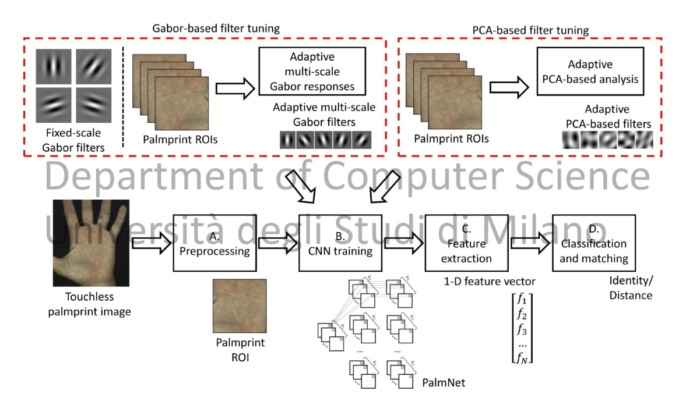

<div align="center">

# 🌴 PalmNet

### Gabor-PCA Convolutional Networks for Touchless Palmprint Recognition

[](https://www.mathworks.com/products/matlab.html)
[](LICENSE)
[](https://ieeexplore.ieee.org/document/8691498)
[](http://iebil.di.unimi.it/palmnet/index.htm)

**Source code for the IEEE TIFS 2019 paper**  
*PalmNet: Gabor-PCA Convolutional Networks for Touchless Palmprint Recognition*

</div>

---

## 🧠 Overview

**PalmNet** is a MATLAB implementation of a palmprint recognition pipeline designed for **touchless biometric acquisition**.  
The method combines:

- **Gabor filtering**
- **PCA-inspired convolutional learning**
- **Adaptive orientation and frequency analysis**
- **Feature extraction for verification and identification**
- **k-NN based classification**

PalmNet was proposed for robust recognition in less-constrained palmprint acquisition scenarios.

---

## 📌 Pipeline

<div align="center">



</div>

At a high level, the system performs:

```text
Palmprint images
      │
      ▼
Pre-processing / ROI input
      │
      ▼
Adaptive Gabor filter learning
      │
      ▼
Gabor-PCA feature extraction
      │
      ▼
Feature encoding and comparison
      │
      ├── Verification: EER / FMR1000
      │
      └── Identification: k-NN accuracy
```

---

## 📁 Repository Structure

```text
PalmNet/
│
├── launch_PalmNet.m                 # Main script
├── params/
│   └── paramsPalmNet.m              # Main parameter configuration
│
├── functions_Biometrics/            # Biometric evaluation utilities
├── functions_Classifiers/           # Classification functions
├── functions_DBProc/                # Dataset and label processing
├── functions_FeatExtr/              # Feature extraction routines
├── functions_Freq/                  # Frequency analysis functions
├── functions_Gabor/                 # Gabor filter learning and processing
├── functions_Kovesi/                # Peter Kovesi computer vision functions
├── functions_Orient/                # Orientation analysis functions
├── histogram_distance/              # Distance metrics
├── util/                            # Utility functions
│
├── images/
│   └── Tongji_Contactless_Palmprint_Dataset/
│
└── LICENSE
```

---

## 🚀 Getting Started

### 1. Clone the repository

```bash
git clone https://github.com/AngeloUNIMI/PalmNet.git
cd PalmNet
```

### 2. Prepare the dataset

Place palmprint images inside:

```text
./images/<dataset_name>/
```

By default, the main script expects:

```text
./images/Tongji_Contactless_Palmprint_Dataset/
```

The expected filename format is:

```text
NNNN_SSSS.ext
```

where:

- `NNNN` is the 4-digit individual ID
- `SSSS` is the 4-digit sample ID
- `ext` is the image extension

Example:

```text
0001_0001.bmp
```

In the original experiments, left and right palms of the same person are treated as different individuals.

### 3. Configure parameters

Edit the main configuration file:

```text
./params/paramsPalmNet.m
```

You can also adjust dataset settings in `launch_PalmNet.m`, for example:

```matlab
ext = 'bmp';
dbname = 'Tongji_Contactless_Palmprint_Dataset';
dirDB = ['./images/' dbname '/'];
```

### 4. Run PalmNet

Open MATLAB and run:

```matlab
launch_PalmNet
```

Results are saved under:

```text
./Results/<dataset_name>/
```

---

## 📊 Output

PalmNet computes both verification and identification metrics, including:

| Task | Metrics |
|---|---|
| Verification | EER, FMR1000, FPR, FNR |
| Aggregated verification | Aggregated EER and FMR1000 |
| Identification | k-NN classification accuracy |
| Logs | Iteration-wise training/testing information |

Generated `.mat` files include extracted features, score matrices, labels, and final performance summaries.

---

## 🧪 Datasets

The datasets used in the original paper can be obtained from the following providers:

| Dataset | Link |
|---|---|
| CASIA Palmprint Database | http://www.cbsr.ia.ac.cn/english/Palmprint%20Databases.asp |
| IITD Palmprint Database | http://www4.comp.polyu.edu.hk/~csajaykr/IITD/Database_Palm.htm |
| REST Hand Database | http://www.regim.org/publications/databases/regim-sfax-tunisian-hand-database2016-rest2016/ |
| Tongji Contactless Palmprint Dataset | http://sse.tongji.edu.cn/linzhang/cr3dpalm/cr3dpalm.htm |

For palmprint segmentation and ROI extraction, see:

```text
https://github.com/AngeloUNIMI/PalmSeg
```

---

## 📚 Related Code and Dependencies

This repository includes or uses code inspired by the following works and libraries:

- T. Chan, K. Jia, S. Gao, J. Lu, Z. Zeng, and Y. Ma,  
  **“PCANet: A Simple Deep Learning Baseline for Image Classification?”**  
  *IEEE Transactions on Image Processing*, 2015.  
  DOI: `10.1109/TIP.2015.2475625`

- A. Vedaldi and B. Fulkerson,  
  **“VLFeat: An Open and Portable Library of Computer Vision Algorithms”**, 2008.  
  http://www.vlfeat.org/

- Peter Kovesi,  
  **MATLAB and Octave Functions for Computer Vision and Image Processing**.  
  https://www.peterkovesi.com/matlabfns/

---

## 📖 Paper

If you use this code, please cite:

```bibtex
@Article{tifs19,
  author  = {A. Genovese and V. Piuri and K. N. Plataniotis and F. Scotti},
  title   = {PalmNet: Gabor-PCA Convolutional Networks for Touchless Palmprint Recognition},
  journal = {IEEE Transactions on Information Forensics and Security},
  year    = {2019},
  note    = {1556-6013}
}
```

Paper:

```text
https://ieeexplore.ieee.org/document/8691498
```

Project page:

```text
http://iebil.di.unimi.it/palmnet/index.htm
```

---

## 🏛 Authors

**Angelo Genovese**  
Department of Computer Science  
Università degli Studi di Milano, Italy

**Vincenzo Piuri**  
Department of Computer Science  
Università degli Studi di Milano, Italy

**Konstantinos N. Plataniotis**  
Department of Electrical and Computer Engineering  
University of Toronto, Canada

**Fabio Scotti**  
Department of Computer Science  
Università degli Studi di Milano, Italy

---

## 📄 License

This project is released under the **GNU General Public License v3.0**.

See the [LICENSE](LICENSE) file for details.
