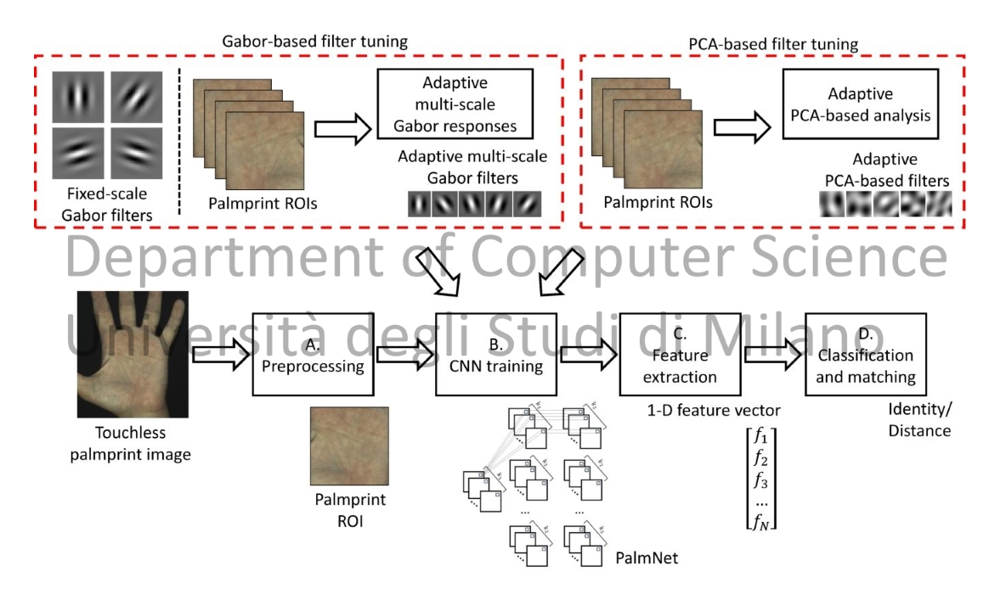

<div align="center">

# 🌴 PalmNet

### Gabor-PCA Convolutional Networks for Touchless Palmprint Recognition

[](https://www.mathworks.com/products/matlab.html)
[](https://www.python.org/)
[](https://pytorch.org/)
[](LICENSE)
[](https://ieeexplore.ieee.org/document/8691498)
[](http://iebil.di.unimi.it/palmnet/index.htm)

**MATLAB and Python/PyTorch implementations of the method presented in the IEEE TIFS 2019 paper**  
*PalmNet: Gabor-PCA Convolutional Networks for Touchless Palmprint Recognition*

</div>

---

## 🧠 Overview

**PalmNet** is a palmprint recognition pipeline designed for **touchless biometric acquisition**. The method combines:

- **Gabor filtering**
- **PCA-based convolutional filter learning**
- **Adaptive orientation analysis and Gabor selection**
- **Binary hashing and block-histogram feature extraction**
- **Verification and identification**
- **k-NN based classification**

This repository contains two implementations:

| Implementation | Description |
|---|---|
| **MATLAB** | Original research implementation and supporting biometric/evaluation functions |
| **Python / PyTorch** | Reimplementation of the active PCA-Gabor pipeline, including MATLAB-compatible evaluation and an optional GPU-optimized execution path |

The Python implementation is intended both for **reproducibility** and for easier experimentation on modern CPU/GPU systems. It preserves the original algorithmic structure rather than replacing PalmNet with a generic trainable CNN.

> **Note on terminology.** The paper and project are named **Gabor-PCA / PalmNet**. The active MATLAB variant ported to Python applies learned PCA filters in the first stage and fixed/adaptively selected Gabor filters in the second stage.

---

## 📌 Processing Pipeline

<div align="center">



</div>

At a high level, the active pipeline implemented in both versions is:

```text
Palmprint ROI
      │
      ▼
Grayscale conversion / resizing / mean removal
      │
      ▼
PCA filter learning and first-stage responses
      │
      ▼
Orientation analysis + fixed/adaptive Gabor filter selection
      │
      ▼
Second-stage Gabor responses
      │
      ▼
Binary hashing + block histograms
      │
      ▼
Sparse PalmNet descriptor
      │
      ├── Verification: EER / FMR1000
      │
      └── Identification: leave-one-out 1-NN accuracy
```

---

## 📁 Repository Structure

The repository is organized so that the dataset can be shared by both implementations:

```text
PalmNet/
│
├── images/
│   └── Tongji_Contactless_Palmprint_Dataset/
│
├── matlab/
│   ├── launch_PalmNet.m
│   ├── params/
│   ├── functions_Biometrics/
│   ├── functions_Classifiers/
│   ├── functions_DBProc/
│   ├── functions_FeatExtr/
│   ├── functions_Freq/
│   ├── functions_Gabor/
│   ├── functions_Kovesi/
│   ├── functions_Orient/
│   ├── histogram_distance/
│   └── util/
│
├── python/
│   ├── main.py
│   ├── requirements.txt
│   ├── requirements-dev.txt
│   ├── pyproject.toml
│   ├── palmnet/                 # Core PyTorch implementation
│   ├── configs/                 # MATLAB-compatible and test configurations
│   ├── tests/                   # Numerical/unit tests
│   ├── validation/              # Validation outputs
│   ├── matlab/                  # MATLAB/Python parity helper
│   ├── verify_matlab.py
│   ├── SOURCE_MAP.md
│   └── VALIDATION.md
│
├── LICENSE
└── README.md
```

The MATLAB code includes the biometric evaluation, dataset-processing, orientation, Gabor, and VLFeat-related utilities used by the original implementation. The Python version contains corresponding ports for the active experiment path and documents the mapping in `python/SOURCE_MAP.md`.

---

## 🧪 Dataset Organization

Place palmprint ROIs in:

```text
./images/<dataset_name>/
```

The Tongji dataset used by the examples is expected at:

```text
./images/Tongji_Contactless_Palmprint_Dataset/
```

For a flat dataset directory, the MATLAB convention is:

```text
NNNN_SSSS.ext
```

where:

- `NNNN` is the 4-digit palm/identity label;
- `SSSS` is the sample number;
- `ext` is the image extension.

Example:

```text
0001_0001.bmp
0001_0002.bmp
0002_0001.bmp
```

The first two files belong to identity `0001`, while the third belongs to identity `0002`.

In the original experimental organization, **left and right palms are treated as different biometric identities**.

The Python loader also supports datasets organized as one subfolder per identity and custom filename formats through a manifest or regular expression.

> The input should already be a palmprint ROI. For palmprint segmentation / ROI extraction, see [PalmSeg](https://github.com/AngeloUNIMI/PalmSeg).

---

# MATLAB Implementation

## Requirements

- MATLAB R2018 or newer is recommended.
- Required third-party/support code is included under `matlab/`, including VLFeat-related files used by the original utilities.

## Configuration

Enter the MATLAB directory:

```text
PalmNet/matlab/
```

The main parameter file is:

```text
params/paramsPalmNet.m
```

Dataset settings are defined in the main script. With the repository structure shown above, the Tongji path should point to the shared root-level `images` directory, for example:

```matlab
ext = 'bmp';
dbname = 'Tongji_Contactless_Palmprint_Dataset';
dirDB = ['../images/' dbname '/'];
```

Adjust this path if MATLAB is launched from a different working directory.

## Run

From MATLAB, change the current folder to `matlab/` and run:

```matlab
launch_PalmNet
```

The MATLAB implementation computes both identification and verification results and stores experiment outputs as `.mat` files.

---

# Python / PyTorch Implementation

The Python implementation reproduces the active MATLAB PCA-Gabor pipeline and adds:

- CPU and CUDA execution;
- batched PyTorch convolutions;
- GPU-parallel PCA covariance accumulation;
- batched orientation analysis;
- batched adaptive Gabor selection;
- sparse feature storage;
- model checkpoint saving/loading;
- reference and optimized execution backends;
- MATLAB-compatible dataset splitting and biometric evaluation;
- MATLAB/Python numerical validation utilities.

## 1. Create a virtual environment

From the repository root:

```powershell
cd python
py -m venv .venv
.\.venv\Scripts\Activate.ps1
python -m pip install --upgrade pip
```

With Command Prompt:

```bat
cd python
py -m venv .venv
.venv\Scripts\activate.bat
python -m pip install --upgrade pip
```

## 2. Install PyTorch and dependencies

For CPU-only execution:

```powershell
python -m pip install torch --index-url https://download.pytorch.org/whl/cpu
python -m pip install -r requirements.txt
```

For an NVIDIA GPU, first install the CUDA-enabled PyTorch build appropriate for the local driver/Python version using the official selector:

https://pytorch.org/get-started/locally/

Then install the remaining requirements:

```powershell
python -m pip install -r requirements.txt
```

Check CUDA availability:

```powershell
python -c "import torch; print(torch.__version__); print('CUDA:', torch.cuda.is_available())"
```

## 3. Quick test without a dataset

```powershell
python main.py demo --device cpu --output demo_results
```

This runs the pipeline on small synthetic ridge-pattern images and verifies that fitting, feature extraction, identification, and verification complete successfully.

## 4. Run Tongji

From `PalmNet/python/`:

```powershell
python main.py experiment `
    --data-root "..\images\Tongji_Contactless_Palmprint_Dataset" `
    --image-size 128 `
    --iterations 1 `
    --device cuda `
    --output results\tongji
```

The filename convention is recognized automatically, so no explicit `--label-regex` is required for filenames such as `0001_0001.bmp`.

For CPU execution, use:

```text
--device cpu
```

or let the program choose automatically:

```text
--device auto
```

---

## ⚡ Parallel / GPU-Optimized Execution

The Python implementation exposes two execution backends:

```text
--execution-backend reference
--execution-backend optimized
```

`auto` is the default and selects the optimized path on CUDA.

The optimized backend parallelizes the most expensive parts of the algorithm:

- **PCA covariance computation** — multiple images are unfolded in batches and covariance is accumulated using large matrix multiplications;
- **PCA eigendecomposition** — performed with `torch.linalg.eigh`;
- **orientation analysis** — multiple images are processed in one batch;
- **adaptive Gabor selection** — candidate Gabor orientations are evaluated together and strong responses are selected using batched `torch.topk`;
- **PCA filtering** — all first-stage PCA filters are evaluated in one convolution;
- **PCA × Gabor filtering** — second-stage responses are vectorized/batched by kernel size;
- **image decoding** — optional PyTorch `DataLoader` workers can decode files in parallel.

A good starting configuration for Tongji is:

```powershell
python main.py experiment `
    --data-root "..\images\Tongji_Contactless_Palmprint_Dataset" `
    --image-size 128 `
    --iterations 1 `
    --device cuda `
    --execution-backend optimized `
    --precision matlab `
    --batch-size 16 `
    --num-workers 4 `
    --pca-image-batch-size 16 `
    --orientation-batch-size 32 `
    --gabor-tuning-batch-size 8 `
    --response-batch-size 128 `
    --output results\tongji_parallel
```

If GPU memory is insufficient, reduce `--response-batch-size` first, then `--gabor-tuning-batch-size` and `--batch-size`.

### Precision modes

Two presets are provided:

```text
--precision matlab
--precision fast
```

| Mode | PCA covariance/eigendecomposition | Gabor responses / feature extraction |
|---|---|---|
| `matlab` | float64 | float64 |
| `fast` | float64 | float32 |

Use `matlab` when comparing against the MATLAB implementation. Use `fast` when speed and GPU memory are more important than very small floating-point differences.

An optional:

```text
--compile
```

flag enables `torch.compile` where supported.

---

## MATLAB-Compatible Experimental Protocol

The default Python protocol reproduces the supplied MATLAB common functions as closely as practical.

Important details include:

- identity extraction from underscore-separated filenames;
- removal of identities with insufficient samples;
- **identity-disjoint person-fold splitting** rather than image-level random splitting;
- default `kfold = 2`;
- Euclidean and chi-square distance definitions;
- leave-one-out 1-NN identification using the second sorted distance to exclude self-matches;
- ordered genuine/impostor comparisons for verification;
- EER computation using the minimum `|FPR - FNR|` criterion;
- FMR1000 computation;
- MATLAB-style score aggregation using `movmax(..., 4)`.

The original MATLAB driver contains an optional/debugging balance setting corresponding to 40 identities × 4 samples. The Python implementation does **not** enable this restriction by default. To reproduce it explicitly:

```powershell
python main.py experiment `
    --data-root "..\images\Tongji_Contactless_Palmprint_Dataset" `
    --max-subjects 40 `
    --samples-per-subject 4 `
    --matlab-balance `
    --iterations 1
```

---

## Training, Checkpointing, and Feature Extraction

Train the unsupervised PCA/Gabor model and save it:

```powershell
python main.py train `
    --data-root "..\images\Tongji_Contactless_Palmprint_Dataset" `
    --checkpoint checkpoints\pca_gabor.pt `
    --device cuda
```

Extract features later without refitting:

```powershell
python main.py extract `
    --data-root "..\images\Tongji_Contactless_Palmprint_Dataset" `
    --checkpoint checkpoints\pca_gabor.pt `
    --output features\tongji.npz `
    --device cuda
```

Features are stored as SciPy sparse matrices because the default descriptor is very high dimensional.

At 128 × 128 pixels, with 15 first-stage PCA filters, 15 second-stage Gabor filters, and 23 × 23 non-overlapping histogram blocks, the nominal descriptor dimensionality is:

```text
15 × 25 × 2^15 = 12,288,000 dimensions
```

Only non-zero histogram entries are stored.

---

## Default Parameters of the Active PCA-Gabor Variant

| Parameter | Default |
|---|---:|
| PCA patch size | 15 × 15 |
| PCA filters | 15 |
| Fixed Gabor orientations | 10 |
| Adaptive orientation candidates | 10 |
| Additional selected Gabor filters | 5 |
| Strongest wavelet responses per training image | 10,000 |
| Fixed Gabor support | 35 × 35 |
| Fixed sigma | 5.6179 |
| Spatial frequency | 0.11 |
| Histogram block size | 23 × 23 |
| Histogram overlap | 0 |
| Default numerical precision | float64 |
| Default nearest neighbors | 1 |
| Default identification distance | Euclidean |

The Python configuration files `python/configs/matlab_v1.json` and `python/configs/matlab_v2.json` provide predefined parameter sets corresponding to the supplied MATLAB variants.

---

## 📊 Outputs

Both implementations evaluate verification and identification.

| Task | Metrics / outputs |
|---|---|
| Verification | EER, FMR1000, FPR, FNR |
| Aggregated verification | Aggregated EER and FMR1000 |
| Identification | Leave-one-out k-NN accuracy |
| MATLAB | `.mat` features, scores, labels, performance summaries |
| Python | configuration, logs, splits, checkpoints, sparse features, distance matrices, predictions, verification curves and summaries |

The Python experiment output also records configuration and environment information to support reproducibility.

---

## 🔬 MATLAB ↔ Python Validation

The Python implementation includes a **reference backend** for numerical debugging and an optimized backend for speed.

For the most conservative MATLAB comparison, use:

```text
--execution-backend reference
--precision matlab
--convolution-backend direct
```

A helper MATLAB script is included under:

```text
python/matlab/export_pytorch_fixture.m
```

It can export a trained MATLAB fixture for comparison with:

```powershell
python verify_matlab.py parity_fixture.mat --device cpu --backend direct
```

The validation utility can compare imported MATLAB filters and intermediate responses against the Python implementation.

Exact bit-for-bit equality across MATLAB and PyTorch is **not guaranteed**, because resizing, floating-point reduction order, eigendecomposition signs, FFT/direct convolution arithmetic, histogram binning, and tie handling can differ between runtimes. The reference mode is provided specifically to minimize such differences when investigating parity.

See:

```text
python/VALIDATION.md
python/SOURCE_MAP.md
```

for additional implementation and validation details.

---

## 🧪 Running the Python Tests

From `python/`:

```powershell
python -m pip install -r requirements-dev.txt
python -m pytest -q
```

The tests cover the main numerical operations, MATLAB-compatible evaluation logic, sparse feature construction, checkpoint loading, and reference-versus-optimized execution paths.

---

## 🗃 Datasets

The datasets used in the original PalmNet study can be obtained from their respective providers:

| Dataset | Link |
|---|---|
| CASIA Palmprint Database | http://www.cbsr.ia.ac.cn/english/Palmprint%20Databases.asp |
| IITD Palmprint Database | http://www4.comp.polyu.edu.hk/~csajaykr/IITD/Database_Palm.htm |
| REST Hand Database | http://www.regim.org/publications/databases/regim-sfax-tunisian-hand-database2016-rest2016/ |
| Tongji Contactless Palmprint Dataset | http://sse.tongji.edu.cn/linzhang/cr3dpalm/cr3dpalm.htm |

Datasets are **not redistributed** by this repository unless their original license explicitly permits it.

---

## 📚 Related Code and Dependencies

PalmNet builds on or includes ideas/code from the following works and libraries:

- T. Chan, K. Jia, S. Gao, J. Lu, Z. Zeng, and Y. Ma,  
  **“PCANet: A Simple Deep Learning Baseline for Image Classification?”**  
  *IEEE Transactions on Image Processing*, 2015.  
  DOI: `10.1109/TIP.2015.2475625`

- A. Vedaldi and B. Fulkerson,  
  **“VLFeat: An Open and Portable Library of Computer Vision Algorithms”**, 2008.  
  http://www.vlfeat.org/

- Peter Kovesi,  
  **MATLAB and Octave Functions for Computer Vision and Image Processing**.  
  https://www.peterkovesi.com/matlabfns/

Additional attribution and redistribution notes for the Python port are documented in:

```text
python/THIRD_PARTY_NOTICES.txt
```

---

## 📖 Citation

If you use PalmNet, please cite:

```bibtex
@article{genovese2019palmnet,
  author  = {Angelo Genovese and Vincenzo Piuri and Konstantinos N. Plataniotis and Fabio Scotti},
  title   = {PalmNet: Gabor-PCA Convolutional Networks for Touchless Palmprint Recognition},
  journal = {IEEE Transactions on Information Forensics and Security},
  year    = {2019}
}
```

Paper:

https://ieeexplore.ieee.org/document/8691498

Project page:

http://iebil.di.unimi.it/palmnet/index.htm

---

## 🏛 Authors

**Angelo Genovese**  
Department of Computer Science  
Università degli Studi di Milano, Italy

**Vincenzo Piuri**  
Department of Computer Science  
Università degli Studi di Milano, Italy

**Konstantinos N. Plataniotis**  
Department of Electrical and Computer Engineering  
University of Toronto, Canada

**Fabio Scotti**  
Department of Computer Science  
Università degli Studi di Milano, Italy

---

## 📄 License

This project is released under the **GNU General Public License v3.0**.

See the [LICENSE](LICENSE) file for details.
